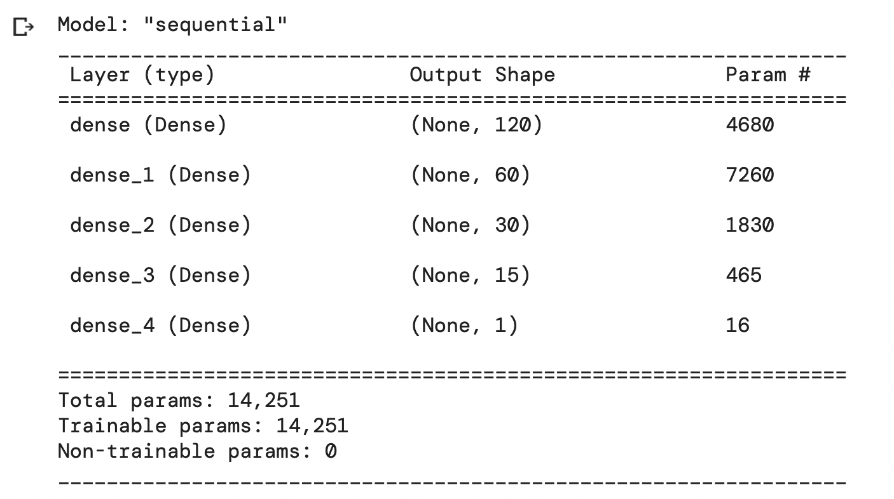

# Neural Network Charity Analysis

## Overview of the analysis:
The purpose of this analysis is to create a binary classifier to predict  whether applicants will be successful if funded by Alphabet Soup.

## Results:
The main results of the analysis are discussed below:
### Data Preprocessing:
- **metadata**:
    - EIN and NAME: identification columns
    - APPLICATION_TYPE: Alphabet Soup application type
    - AFFILIATION: Affiliated sector of industry
    - CLASSIFICATION: Government organization classification
    - USE_CASE: Use case for funding
    - ORGANIZATION: Organization type
    - STATUS: Active status
    - INCOME_AMT: Income classification
    - SPECIAL_CONSIDERATIONS: Special consideration for application
    - ASK_AMT: Funding amount requested
    - IS_SUCCESSFUL: Was the money used effectively

- **target** variable: `IS_SUCCESSFUL` 
- **features**: 
	- `APPLICATION_TYPE`
	- `AFFILIATION`
	- `CLASSIFICATION`
	- `USE_CASE`
	- `ORGANIZATION`
	- `STATUS`
	- `INCOME_AMT`
	- `SPECIAL_CONSIDERATIONS`
	- `ASK_AMT`

- **'irrelevant'** variables:
	- `EIN`
	- `NAME` 
	- `STATUS` - *almost all of the applicants have active status of 1*
	- `SPECIAL_CONSIDERATIONS_N` - *redundant (after encoding)*

### Compiling, Training, and Evaluating the Model:
- I used four hidden layers with 120, 60, 30, and 15 neurons: 
 

- Compile Model:
	```# Compile
	optimizer=tf.keras.optimizers.Adam(learning_rate=1e-4)
	nn.compile(loss="binary_crossentropy", optimizer=optimizer, metrics=["accuracy"])
	```
 
- I tried different number of neurons and layers for the hidden layers together with the `relu` and `leaky_relu` activation functions; `sigmoid` for the output layer. Unfortunately, I was not able to achieve 75%  model accuracy. 

## Summary:
In summarize, this was a good opporunity to read and learn more on *neural nets* `tensorflow`. Given the nature of the dataset at hand, largely due to the presence of many categorical varibles, achieving a high model acccuracy for the classification would require more work in the EDA stage. Changing the learning rate for the `adam` optimizer seamed to improve the oscillation in the convergence. 

